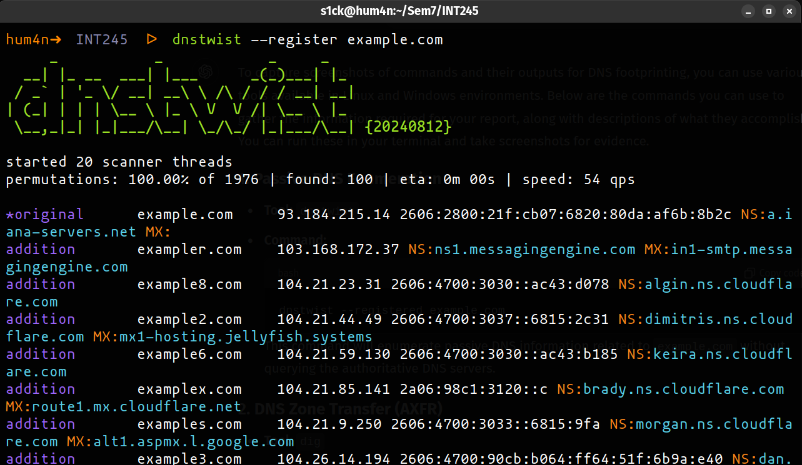
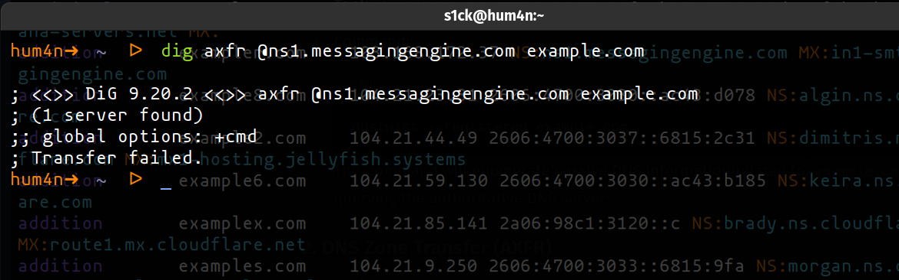
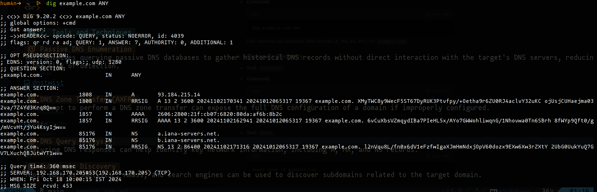
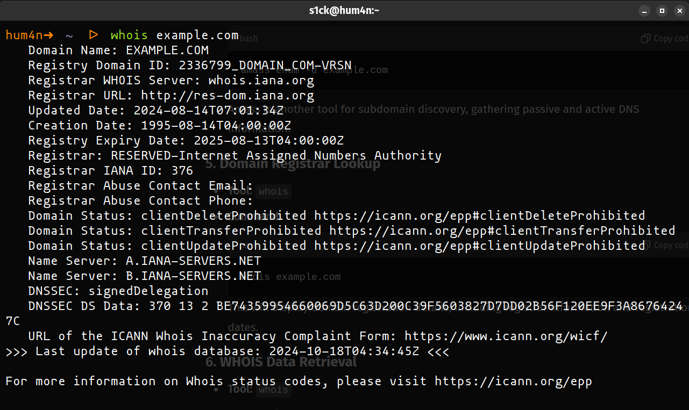
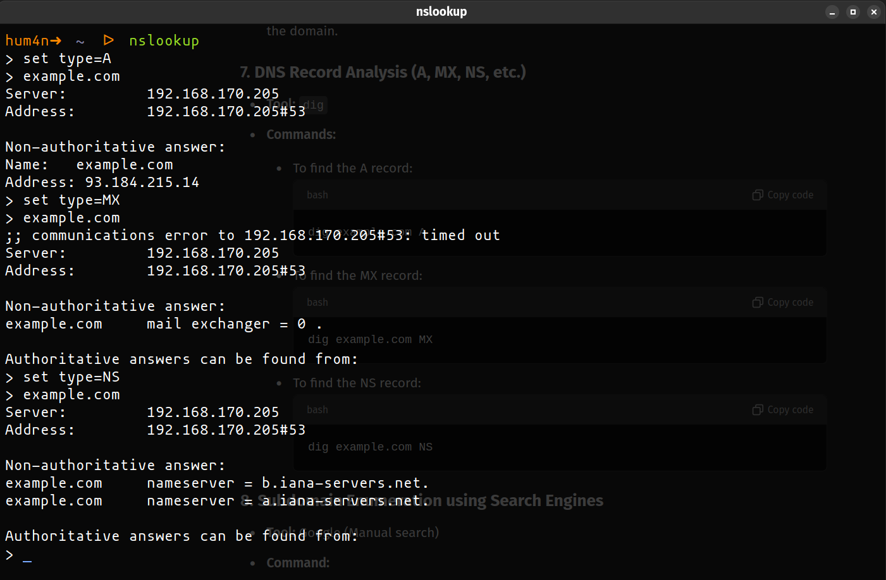
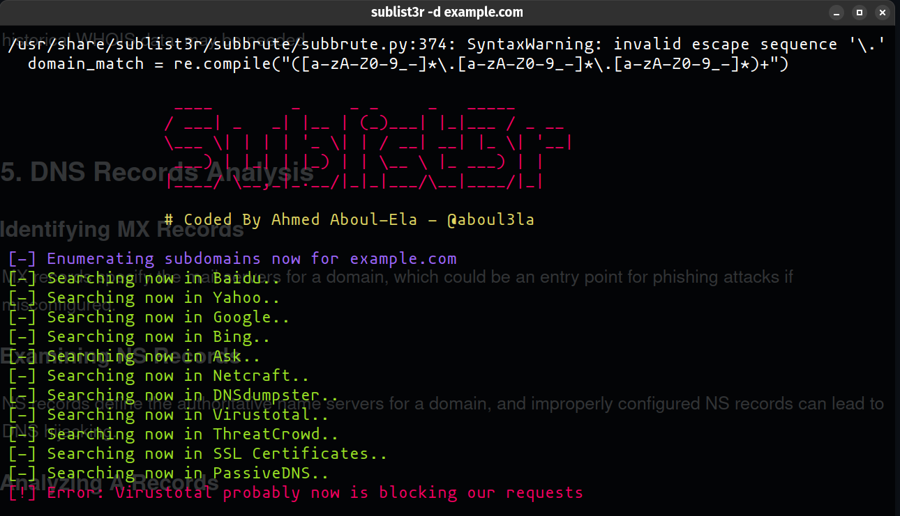
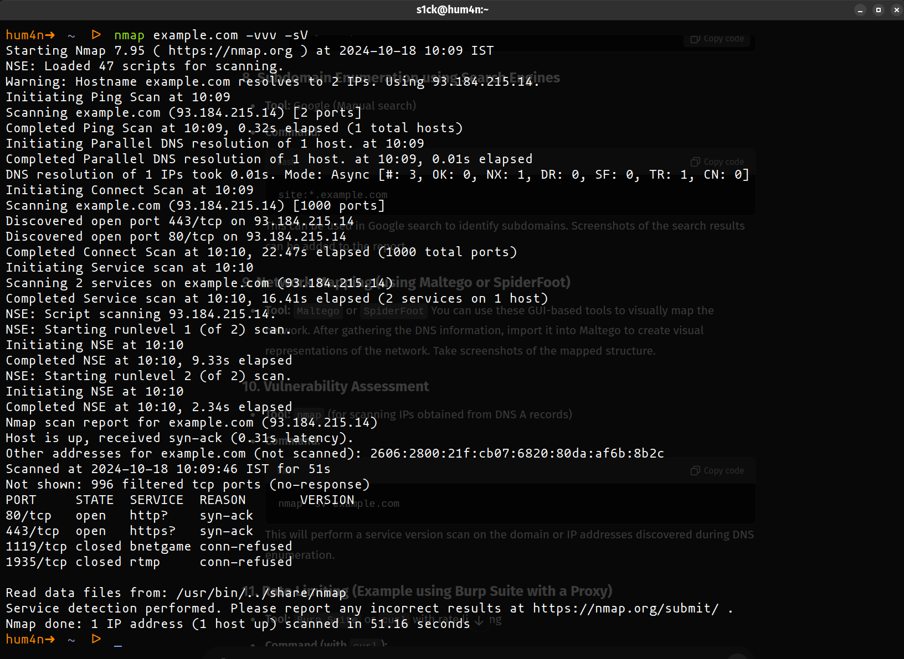
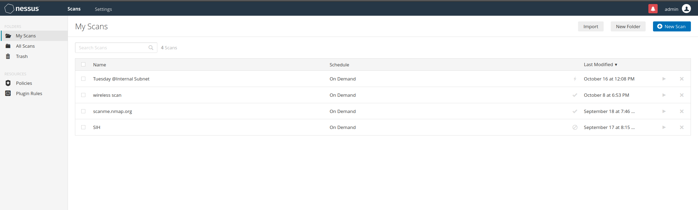

# DNS Footprinting Report

 

> Author : s1ck 😉

 
 

## Table of Contents

1. [Introduction](#1-introduction)
2. [Tools and Techniques](#2-tools-and-techniques)
    - [Passive DNS Enumeration](#passive-dns-enumeration)
    - [DNS Zone Transfer (AXFR)](#dns-zone-transfer-axfr)
    - [DNS Query Analysis](#dns-query-analysis)
    - [Subdomain Discovery](#subdomain-discovery)
    - [Domain Registrar Lookup](#domain-registrar-lookup)
    - [WHOIS Data Retrieval](#whois-data-retrieval)
    - [DNS Record Analysis](#dns-record-analysis-a-mx-ns-etc)
3. [Gathering Information Without Triggering Alerts](#3-gathering-information-without-triggering-alerts)
    - [Using Public DNS Resolvers](#using-public-dns-resolvers)
    - [Employing Proxy Servers](#employing-proxy-servers)
    - [Utilizing VPNs](#utilizing-vpns)
    - [Implementing Rate Limiting](#implementing-rate-limiting)
    - [Leveraging Open-Source Intelligence (OSINT) Tools](#leveraging-open-source-intelligence-osint-tools)
4. [Domain Registrant Details](#4-domain-registrant-details)
    - [Using WHOIS Databases](#using-whois-databases)
    - [Employing Domain Registration Services](#employing-domain-registration-services)
    - [Analyzing Domain Privacy Protection](#analyzing-domain-privacy-protection)
5. [DNS Records Analysis](#5-dns-records-analysis)
    - [Identifying MX Records](#identifying-mx-records)
    - [Examining NS Records](#examining-ns-records)
    - [Analyzing A Records](#analyzing-a-records)
    - [Investigating Other Relevant DNS Records](#investigating-other-relevant-dns-records)
6. [Subdomain Discovery](#6-subdomain-discovery)
    - [Using Online Search Engines](#using-online-search-engines)
    - [Employing Specialized Subdomain Enumeration Tools](#employing-specialized-subdomain-enumeration-tools)
    - [Analyzing DNS Zone Transfers](#analyzing-dns-zone-transfers)
    - [Exploiting Known Patterns in Subdomain Structures](#exploiting-known-patterns-in-subdomain-structures)
7. [Network Mapping](#7-network-mapping)
    - [Creating Visual Representations of the Network Structure](#creating-visual-representations-of-the-network-structure)
    - [Identifying Potential Entry Points](#identifying-potential-entry-points)
    - [Analyzing Relationships Between Domains and Subdomains](#analyzing-relationships-between-domains-and-subdomains)
8. [Vulnerability Assessment](#8-vulnerability-assessment)
    - [Identifying Misconfigurations](#identifying-misconfigurations)
    - [Analyzing Security Measures](#analyzing-security-measures)
    - [Detecting Potential Attack Vectors](#detecting-potential-attack-vectors)
9. [Ethical Considerations](#9-ethical-considerations)
    - [Respecting Privacy and Legal Boundaries](#respecting-privacy-and-legal-boundaries)
    - [Avoiding Unauthorized Access](#avoiding-unauthorized-access)
    - [Maintaining Transparency in Reporting Findings](#maintaining-transparency-in-reporting-findings)
10. [Conclusion](#10-conclusion)

 
 

---

 
 

### 1. Introduction

DNS footprinting is the process of gathering information about a domain and its associated subdomains, DNS records, and IP addresses. It is crucial for identifying potential vulnerabilities in a network. By mapping the DNS infrastructure, security professionals can detect misconfigurations and other security weaknesses.

 
 

### 2. Tools and Techniques

#### Passive DNS Enumeration
This involves querying passive DNS databases to gather historical DNS records without direct interaction with the target's DNS servers, reducing the risk of detection.

>- using dntwist for passive DNS enum

#### DNS Zone Transfer (AXFR)
An attempt to perform a DNS zone transfer can expose the full DNS configuration of a domain if improperly configured.

> - using dig for the axfr request

#### DNS Query Analysis
Analyzing DNS responses can help identify key network information, including A, MX, and NS records.

#### Subdomain Discovery
Tools such as Sublist3r, Amass, and search engines can be used to discover subdomains related to the target domain.

#### Domain Registrar Lookup
By looking up domain registrar information, you can determine who owns the domain and the associated registration details.

#### WHOIS Data Retrieval
WHOIS tools are used to extract information about the domain owner, registration date, and other relevant details.

#### DNS Record Analysis (A, MX, NS, etc.)
These records provide insight into the services hosted on a domain, including mail servers (MX), name servers (NS), and web servers (A).

 
 

### 3. Gathering Information Without Triggering Alerts

> - dig to get basics ANY - all types of records

#### Using Public DNS Resolvers
Querying public DNS resolvers rather than directly interacting with the target's DNS infrastructure can help avoid detection.

#### Employing Proxy Servers
Using proxies allows for masking the source of DNS queries, making it harder for the target to detect the origin of the reconnaissance.

#### Utilizing VPNs
VPNs can be used to anonymize DNS queries and avoid triggering alerts on the target network.

#### Implementing Rate Limiting

> - using curl for rate limit request

Rate limiting queries can help avoid triggering alarms that may be set to detect unusual volumes of DNS requests.

#### Leveraging Open-Source Intelligence (OSINT) Tools
Using OSINT tools to gather DNS-related information from publicly available sources allows for passive reconnaissance.

 
 

### 4. Domain Registrant Details

> - whois helps us to know more about domain registration details

 

#### Using WHOIS Databases
WHOIS databases contain details about domain ownership, which can be queried using tools such as whois or online services.

#### Employing Domain Registration Services
Domain registration lookup tools, such as DomainTools, can be used to gather additional registration information.

#### Analyzing Domain Privacy Protection
If the domain owner has opted for privacy protection services, additional methods, such as cross-referencing historical WHOIS data, may be needed.

 
 

### 5. DNS Records Analysis

> - nslookup tool is used for DNS based requests, just like dig

#### Identifying MX Records
MX records specify the mail servers for a domain, which could be an entry point for phishing attacks if misconfigured.

#### Examining NS Records
NS records define the authoritative name servers for a domain, and improperly configured NS records can lead to DNS hijacking.

#### Analyzing A Records
A records map domain names to IP addresses, which could be probed for vulnerabilities if mismanaged.

#### Investigating Other Relevant DNS Records
Additional records such as TXT, CNAME, and SPF provide further details about the domain's configuration and potential weaknesses.

 
 

### 6. Subdomain Discovery

> - using sublist3r for subdomain enum

#### Using Online Search Engines
Search engines like Google can be used to identify subdomains through advanced search operators.

#### Employing Specialized Subdomain Enumeration Tools
Tools such as Sublist3r, Knockpy, and Amass are designed specifically for discovering subdomains.

#### Analyzing DNS Zone Transfers
If a zone transfer is allowed, it may reveal all subdomains under a domain.

#### Exploiting Known Patterns in Subdomain Structures
Attackers can identify subdomains by exploiting common naming patterns used by companies (e.g., dev.example.com).

 
 

### 7. Network Mapping

> - nmap helps us scan networks for open ports, vulns, services, etc.

#### Creating Visual Representations of the Network Structure
Once DNS records and subdomains are identified, tools such as Maltego or SpiderFoot can be used to create a visual map of the network.

#### Identifying Potential Entry Points
By mapping the DNS and network structure, potential vulnerabilities and attack surfaces can be identified.

#### Analyzing Relationships Between Domains and Subdomains
Understanding the relationship between the main domain and its subdomains can highlight dependencies and possible vulnerabilities.

 
 

### 8. Vulnerability Assessment

> - nessus - VAPT scanner 

#### Identifying Misconfigurations
Improperly configured DNS servers, such as open zone transfers, can expose sensitive information.

#### Analyzing Security Measures
Assessing the use of security features, such as DNSSEC, can indicate how well the DNS infrastructure is protected.

#### Detecting Potential Attack Vectors
Common vulnerabilities such as DNS spoofing, cache poisoning, and misconfigured subdomains can be identified and mitigated.

 
 

### 9. Ethical Considerations

#### Respecting Privacy and Legal Boundaries
DNS footprinting must always adhere to legal frameworks and ethical standards, ensuring no unauthorized access or data theft occurs.

#### Avoiding Unauthorized Access
No part of the process should involve exploiting vulnerabilities or accessing protected resources without permission.

#### Maintaining Transparency in Reporting Findings
When conducting a DNS footprinting assessment, it's important to maintain full transparency in reporting the findings to the appropriate stakeholders.

 
 

### 10. Conclusion

DNS footprinting is an essential step in network security assessments, allowing professionals to map network infrastructure and detect potential vulnerabilities. By utilizing a combination of tools and techniques, valuable insights can be gained while minimizing the risk of detection. Following ethical guidelines ensures that the process is both legal and responsible.

